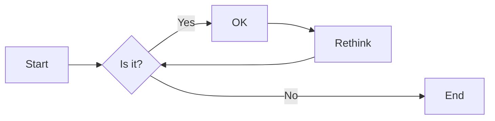
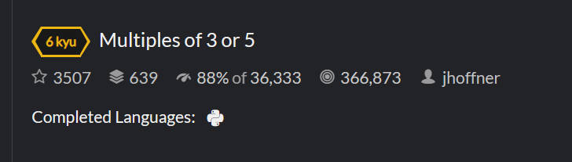
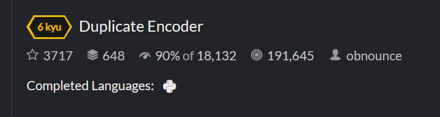
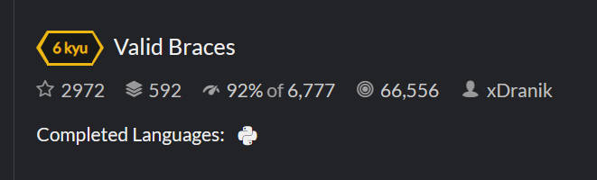
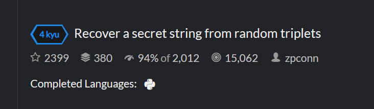
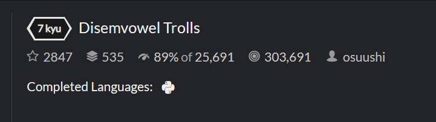
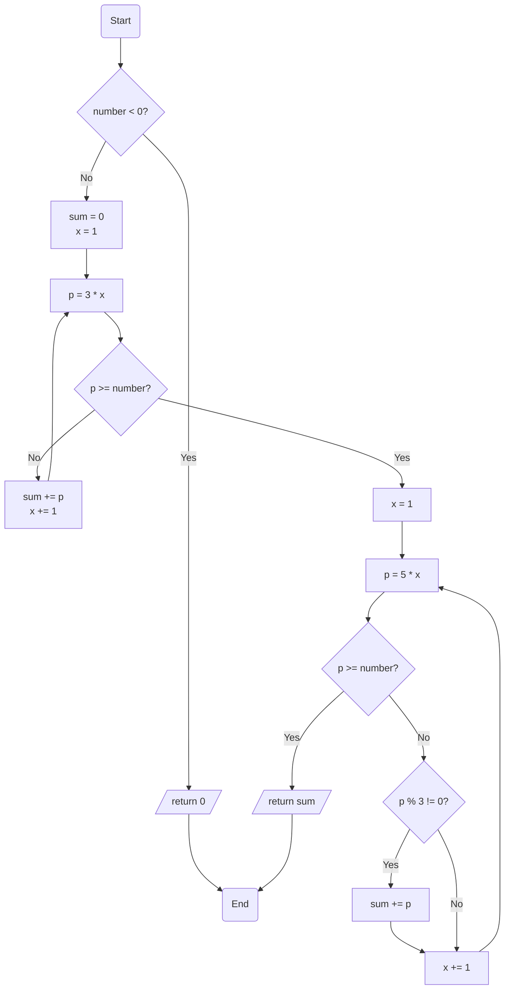

# 实验三 Python列表

班级： 21计科4

学号： B20210404205

姓名： 康佳程

Github地址：<https://github.com/ktxiaok/python_experiments_2023.git>

CodeWars地址：<https://www.codewars.com/users/ktxiaok>

---

## 实验目的

1. 学习Python的简单使用和列表操作
2. 学习Python中的if语句

## 实验环境

1. Git
2. Python 3.10
3. VSCode
4. VSCode插件

## 实验内容和步骤

### 第一部分

Python列表操作

完成教材《Python编程从入门到实践》下列章节的练习：

- 第3章 列表简介
- 第4章 操作列表
- 第5章 if语句

---

### 第二部分

在[Codewars网站](https://www.codewars.com)注册账号，完成下列Kata挑战：

---

#### 第一题：3和5的倍数（Multiples of 3 or 5）

难度： 6kyu

如果我们列出所有低于 10 的 3 或 5 倍数的自然数，我们得到 3、5、6 和 9。这些数的总和为 23. 完成一个函数，使其返回小于某个整数的所有是3 或 5 的倍数的数的总和。此外，如果数字为负数，则返回 0。

注意：如果一个数同时是3和5的倍数，应该只被算一次。

**提示：首先使用列表解析得到一个列表，元素全部是3或者5的倍数。
使用sum函数可以获取这个列表所有元素的和.**

代码提交地址：
<https://www.codewars.com/kata/514b92a657cdc65150000006>

---

#### 第二题： 重复字符的编码器（Duplicate Encoder）

难度： 6kyu

本练习的目的是将一个字符串转换为一个新的字符串，如果新字符串中的每个字符在原字符串中只出现一次，则为"("，如果该字符在原字符串中出现多次，则为")"。在判断一个字符是否是重复的时候，请忽略大写字母。

例如:

```python
"din"      =>  "((("
"recede"   =>  "()()()"
"Success"  =>  ")())())"
"(( @"     =>  "))(("
```

代码提交地址:
<https://www.codewars.com/kata/54b42f9314d9229fd6000d9c>

---

#### 第三题：括号匹配（Valid Braces）

难度：6kyu

写一个函数，接收一串括号，并确定括号的顺序是否有效。如果字符串是有效的，它应该返回True，如果是无效的，它应该返回False。
例如：

```python
"(){}[]" => True 
"([{}])" => True
 "(}" => False
 "[(])" => False 
"[({})](]" => False
```

**提示：
python中没有内置堆栈数据结构，可以直接使用`list`来作为堆栈，其中`append`方法用于入栈，`pop`方法可以出栈。**

代码提交地址
<https://www.codewars.com/kata/5277c8a221e209d3f6000b56>

---

#### 第四题： 从随机三元组中恢复秘密字符串(Recover a secret string from random triplets)

难度： 4kyu

有一个不为你所知的秘密字符串。给出一个随机三个字母的组合的集合，恢复原来的字符串。

这里的三个字母的组合被定义为三个字母的序列，每个字母在给定的字符串中出现在下一个字母之前。"whi "是字符串 "whatisup "的一个三个字母的组合。

作为一种简化，你可以假设没有一个字母在秘密字符串中出现超过一次。

对于给你的三个字母的组合，除了它们是有效的三个字母的组合以及它们包含足够的信息来推导出原始字符串之外，你可以不做任何假设。特别是，这意味着秘密字符串永远不会包含不出现在给你的三个字母的组合中的字母。

测试用例：

```python
secret = "whatisup"
triplets = [
  ['t','u','p'],
  ['w','h','i'],
  ['t','s','u'],
  ['a','t','s'],
  ['h','a','p'],
  ['t','i','s'],
  ['w','h','s']
]
test.assert_equals(recoverSecret(triplets), secret)
```

代码提交地址：
<https://www.codewars.com/kata/53f40dff5f9d31b813000774/train/python>

提示：

- 利用集合去掉`triplets`中的重复字母，得到字母集合`letters`，最后的`secret`应该由集合中的字母组成，`secret`长度也等于该集合。

```python
letters = {letter for triplet in triplets for letter in triplet }
length = len(letters)
```

- 创建函数`check_first_letter(triplets, first_letter)`，检测一个字母是不是secret的首字母，返回True或者False。
- 创建函数`remove_first_letter(triplets, first_letter)`,  从三元组中去掉首字母，返回新的三元组。
- 遍历字母集合letters，利用上面2个函数得到最后的结果`secret`。

---

#### 第五题： 去掉喷子的元音（Disemvowel Trolls）

难度： 7kyu

喷子正在攻击你的评论区!
处理这种情况的一个常见方法是删除喷子评论中的所有元音(字母：a,e,i,o,u)，以消除威胁。
你的任务是写一个函数，接收一个字符串并返回一个去除所有元音的新字符串。
例如，字符串 "This website is for losers LOL!"   将变成 "Ths wbst s fr lsrs LL!".

注意：对于这个Kata来说，y不被认为是元音。
代码提交地址：
<https://www.codewars.com/kata/52fba66badcd10859f00097e>

提示：

- 首先使用列表解析得到一个列表，列表中所有不是元音的字母。
- 使用字符串的join方法连结列表中所有的字母，例如：

```python
last_name = "lovelace"
letters = [letter for letter in last_name ]
print(letters) # ['l', 'o', 'v', 'e', 'l', 'a', 'c', 'e']
name = ''.join(letters) # name = "lovelace"
```

---

### 第三部分

使用Mermaid绘制程序流程图

安装VSCode插件：

- Markdown Preview Mermaid Support
- Mermaid Markdown Syntax Highlighting

使用Markdown语法绘制你的程序绘制程序流程图（至少一个）

显示效果如下：



查看Mermaid流程图语法-->[点击这里](https://mermaid.js.org/syntax/flowchart.html)

使用Markdown编辑器（例如VScode）编写本次实验的实验报告，包括[实验过程与结果](#实验过程与结果)、[实验考查](#实验考查)和[实验总结](#实验总结)，并将其导出为 **PDF格式** 来提交。

## 实验过程与结果

请将实验过程与结果放在这里，包括：

- [第一部分 Python列表操作和if语句](#第一部分)
- [第二部分 Codewars Kata挑战](#第二部分)
- [第三部分 使用Mermaid绘制程序流程图](#第三部分)

### Codewars Kata挑战
#### 第一题：3和5的倍数（Multiples of 3 or 5）
```python
def solution(number):
    if number < 0:
        return 0
    sum = 0
    x = 1
    while True:
        p = 3 * x
        if p >= number:
            break
        sum += p
        x += 1
    x = 1
    while True:
        p = 5 * x
        if p >= number:
            break
        if p % 3 != 0:
            sum += p
        x += 1
    return sum
```


#### 第二题： 重复字符的编码器（Duplicate Encoder）
```python
def duplicate_encode(word):
    word = word.lower()
    char_count = {}
    for c in word:
        if c not in char_count:
            char_count[c] = 0
        char_count[c] += 1
    result = ""
    for c in word:
        if char_count[c] == 1:
            result += "("
        else:
            result += ")"
    return result
```


#### 第三题：括号匹配（Valid Braces）
```python
def valid_braces(string):
    brace_start = {"{", "[", "("}
    brace_end = {"}" : "{", "]" : "[", ")" : "("}
    stack = []
    for c in string:
        if c in brace_start:
            stack.append(c)
        elif c in brace_end:
            brace_expected = brace_end[c]
            if len(stack) == 0:
                return False
            if stack.pop() != brace_expected:
                return False
        else:
            return False
    return len(stack) == 0
```


#### 第四题： 从随机三元组中恢复秘密字符串(Recover a secret string from random triplets)
```python
def recoverSecret(triplets):
    letters = set()
    for triple in triplets:
        for letter in triple:
            letters.add(letter)
    letters = list(letters)
    while True:
        has_exchange = False
        for triple in triplets:
            for i in range(2):
                letter1 = triple[i]
                letter2 = triple[i + 1]
                letter1_idx = letters.index(letter1)
                letter2_idx = letters.index(letter2)
                if letter1_idx > letter2_idx:
                    has_exchange = True
                    letters[letter1_idx] = letter2
                    letters[letter2_idx] = letter1
        if not has_exchange:
            return "".join(letters)
```


#### 第五题： 去掉喷子的元音（Disemvowel Trolls）
```python
def disemvowel(string_):
    return "".join([char for char in string_ if char.lower() not in {'a', 'e', 'i', 'o', 'u'}])
```


### Mermaid程序流程图
第一题：3和5的倍数（Multiples of 3 or 5）


## 实验考查

请使用自己的语言并使用尽量简短代码示例回答下面的问题，这些问题将在实验检查时用于提问和答辩以及实际的操作。

1. Python中的列表可以进行哪些操作？
访问和删除元素：


列表用数字索引来访问元素，索引从0开始。
```python
numbers = [3, 8, 12, 16]
print(numbers[1]) # 访问第二个元素，即元素8
numbers[0] = 0 # 修改第一个元素为0
del numbers[0] # 删除第一个元素
```


列表操作符：+号用来拼接，*号用来重复
```python
print([1, 2, 3] + [4, 5, 6]) # [1, 2, 3, 4, 5, 6]
print([1, 2] * 3) # [1, 2, 1, 2, 1, 2]
```


列表相关函数：

---
len(list)

返回列表元素个数

---

max(list)

返回列表元素最大值

---

min(list)

返回列表元素最小值

---

list(obj)

将对象转换为列表

---

list.append(obj)

在列表末尾添加新的对象

---

list.count(obj)

统计该对象在列表中出现的次数

---

list.index(obj)

返回该对象在列表中第一个匹配项的索引位置

---

list.insert(index, obj)

将该对象插入列表的索引为index的位置

---

list.pop(index = -1)

移除列表中指定索引位置的元素（默认为最后一个元素），并且返回该元素的值

---

list.remove(obj)

移除列表中该对象的第一个匹配项

---

list.reverse()

反向列表中的元素

---

list.clear()

清空列表

---

list.copy()

返回列表的副本

---

2. 哪两种方法可以用来对Python的列表排序？这两种方法有和区别？

通过list.sort()方法或者内置函数sorted(list)可以对列表进行排序。

sort会修改原列表，而sorted返回一个新的列表。

sort只能用在列表上，而sorted可以接受任何可迭代的对象。

3. 如何将Python列表逆序打印？

使用list.reverse()方法或者反向遍历打印。

4. Python中的列表执行哪些操作时效率比较高？哪些操作效率比较差？是否有类似的数据结构可以用来替代列表？

列表进行元素的按索引随机访问的效率很高，但对元素的随机查询、添加、删除效率较差，可以用链表、字典（哈希表）等代替。

5. 阅读《Fluent Python》Chapter 2. An Array of Sequence - Tuples Are Not Just Immutable Lists小节（p30-p35）。总结该小节的主要内容。

tuple不只是不可变的list，tuple强调了它的长度和元素的顺序，并且比list更具有清晰性和更好的性能。

## 实验总结

总结一下这次实验你学习和使用到的知识，例如：编程工具的使用、数据结构、程序语言的语法、算法、编程技巧、编程思想。

本次实验学习了列表的定义和使用方法、推导式、元组的本质和与列表的联系。合理利用Python中的各种特性，能写出简洁优美的代码。