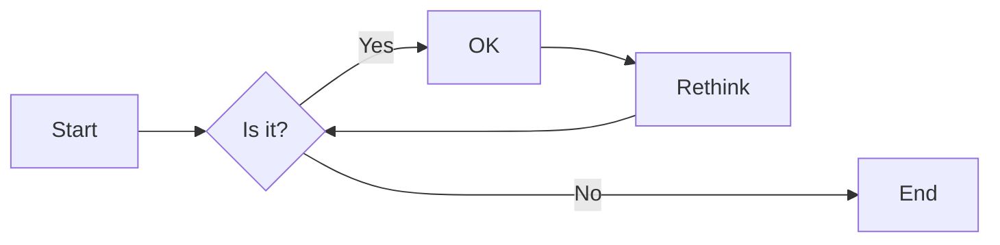
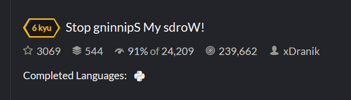
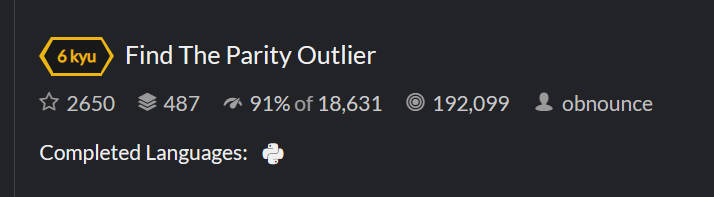
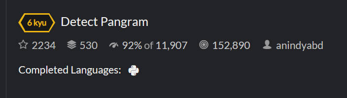
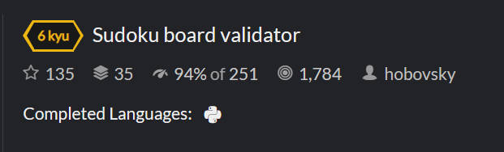
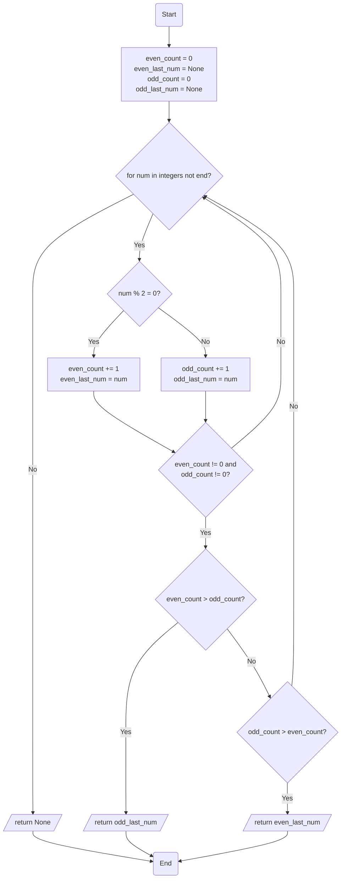

# 实验五 Python数据结构与数据模型

班级： 21计科4

学号： B20210404205

姓名： 康佳程

Github地址：<https://github.com/ktxiaok/python_experiments_2023.git>

CodeWars地址：<https://www.codewars.com/users/ktxiaok>

---

## 实验目的

1. 学习Python数据结构的高级用法
2. 学习Python的数据模型

## 实验环境

1. Git
2. Python 3.10
3. VSCode
4. VSCode插件

## 实验内容和步骤

### 第一部分

在[Codewars网站](https://www.codewars.com)注册账号，完成下列Kata挑战：

---

#### 第一题：停止逆转我的单词

难度： 6kyu

编写一个函数，接收一个或多个单词的字符串，并返回相同的字符串，但所有5个或更多的字母单词都是相反的（就像这个Kata的名字一样）。传入的字符串将只由字母和空格组成。只有当出现一个以上的单词时，才会包括空格。
例如：

```python
spinWords( "Hey fellow warriors" ) => returns "Hey wollef sroirraw" 
spinWords( "This is a test") => returns "This is a test" 
spinWords( "This is another test" )=> returns "This is rehtona test"
```

代码提交地址：
<https://www.codewars.com/kata/5264d2b162488dc400000001>

提示：

- 利用str的split方法可以将字符串分为单词列表
例如：

```python
words = "hey fellow warrior".split()
# words should be ['hey', 'fellow', 'warrior']
```

- 利用列表推导将长度大于等于5的单词反转(利用切片word[::-1])
- 最后使用str的join方法连结列表中的单词。

---

#### 第二题： 发现离群的数(Find The Parity Outlier)

难度：6kyu

给你一个包含整数的数组（其长度至少为3，但可能非常大）。该数组要么完全由奇数组成，要么完全由偶数组成，除了一个整数N。请写一个方法，以该数组为参数，返回这个 "离群 "的N。

例如：

```python
[2, 4, 0, 100, 4, 11, 2602, 36]
# Should return: 11 (the only odd number)

[160, 3, 1719, 19, 11, 13, -21]
# Should return: 160 (the only even number)
```

代码提交地址：
<https://www.codewars.com/kata/5526fc09a1bbd946250002dc>

---

#### 第三题： 检测Pangram

难度：6kyu

pangram是一个至少包含每个字母一次的句子。例如，"The quick brown fox jumps over the lazy dog "这个句子就是一个pangram，因为它至少使用了一次字母A-Z（大小写不相关）。

给定一个字符串，检测它是否是一个pangram。如果是则返回`True`，如果不是则返回`False`。忽略数字和标点符号。
代码提交地址：
<https://www.codewars.com/kata/545cedaa9943f7fe7b000048>

---

#### 第四题： 数独解决方案验证

难度：6kyu

数独背景

数独是一种在 9x9 网格上进行的游戏。游戏的目标是用 1 到 9 的数字填充网格的所有单元格，以便每一列、每一行和九个 3x3 子网格（也称为块）中的都包含数字 1 到 9。更多信息请访问：<http://en.wikipedia.org/wiki/Sudoku>

编写一个函数接受一个代表数独板的二维数组，如果它是一个有效的解决方案则返回 true，否则返回 false。数独板的单元格也可能包含 0，这将代表空单元格。包含一个或多个零的棋盘被认为是无效的解决方案。棋盘总是 9 x 9 格，每个格只包含 0 到 9 之间的整数。

代码提交地址：
<https://www.codewars.com/kata/63d1bac72de941033dbf87ae>

---

#### 第五题： 疯狂的彩色三角形

难度： 2kyu

一个彩色的三角形是由一排颜色组成的，每一排都是红色、绿色或蓝色。连续的几行，每一行都比上一行少一种颜色，是通过考虑前一行中的两个相接触的颜色而产生的。如果这些颜色是相同的，那么新的一行就使用相同的颜色。如果它们不同，则在新的一行中使用缺失的颜色。这个过程一直持续到最后一行，只有一种颜色被生成。

例如：
```python
Colour here:            G G        B G        R G        B R
Becomes colour here:     G          R          B          G
```


一个更大的三角形例子：

```python
R R G B R G B B
 R B R G B R B
  G G B R G G
   G R G B G
    B B R R
     B G R
      R B
       G
```

你将得到三角形的第一行字符串，你的工作是返回最后的颜色，这将出现在最下面一行的字符串。在上面的例子中，你将得到 "RRGBRGBB"，你应该返回 "G"。
限制条件： 1 <= length(row) <= 10 ** 5
输入的字符串将只包含大写字母'B'、'G'或'R'。

例如：

```python
triangle('B') == 'B'
triangle('GB') == 'R'
triangle('RRR') == 'R'
triangle('RGBG') == 'B'
triangle('RBRGBRB') == 'G'
triangle('RBRGBRBGGRRRBGBBBGG') == 'G'
```

代码提交地址：
<https://www.codewars.com/kata/5a331ea7ee1aae8f24000175>

提示：请参考下面的链接，利用三进制的特点来进行计算。
<https://stackoverflow.com/questions/53585022/three-colors-triangles>

---

### 第二部分

使用Mermaid绘制程序流程图

安装VSCode插件：

- Markdown Preview Mermaid Support
- Mermaid Markdown Syntax Highlighting

使用Markdown语法绘制你的程序绘制程序流程图（至少一个）

显示效果如下：



查看Mermaid流程图语法-->[点击这里](https://mermaid.js.org/syntax/flowchart.html)

使用Markdown编辑器（例如VScode）编写本次实验的实验报告，包括[实验过程与结果](#实验过程与结果)、[实验考查](#实验考查)和[实验总结](#实验总结)，并将其导出为 **PDF格式** 来提交。

## 实验过程与结果

请将实验过程与结果放在这里，包括：

- [第一部分 Codewars Kata挑战](#第一部分)
- [第二部分 使用Mermaid绘制程序流程图](#第二部分)

### Codewars Kata挑战

#### 第一题：停止逆转我的单词

```python
def spin_words(sentence):
    return ' '.join([word[::-1] if len(word) >= 5 else word for word in sentence.split(' ')])
```


#### 第二题： 发现离群的数(Find The Parity Outlier)

```python
def find_outlier(integers):
    even_count = 0
    even_last_num = None
    odd_count = 0
    odd_last_num = None
    for num in integers:
        if num % 2 == 0:
            even_count += 1
            even_last_num = num
        else:
            odd_count += 1
            odd_last_num = num
        if even_count != 0 and odd_count != 0:
            if even_count > odd_count:
                return odd_last_num
            elif odd_count > even_count:
                return even_last_num
    return None
```


#### 第三题： 检测Pangram

```python
def is_pangram(s):
    s = s.lower()
    letters = {'a', 'b', 'c', 'd', 'e', 'f', 'g', 'h', 'i', 'j', 'k', 'l', 'm', 'n', 'o', 'p', 'q', 'r', 's', 't', 'u', 'v', 'w', 'x', 'y', 'z'}
    for c in s:
        letters.discard(c)
    return len(letters) == 0
```


#### 第四题： 数独解决方案验证

```python
def validate_sudoku(board):
    exist_set = set()
    def validate_numbers(nums):
        exist_set.clear()
        for num in nums:
            if num == 0:
                return False
            if num in exist_set:
                return False
            exist_set.add(num)
        return True
    for row in board:
        if not validate_numbers(row):
            return False
    def get_column(idx):
        for row in board:
            yield row[idx]
    for i in range(9):
        if not validate_numbers(get_column(i)):
            return False
    def get_block(r_idx, c_idx):
        for i in range(r_idx, r_idx + 3):
            row = board[i]
            for j in range(c_idx, c_idx + 3):
                yield row[j]
    for i in range(0, 9, 3):
        for j in range(0, 9, 3):
            if not validate_numbers(get_block(i, j)):
                return False
    return True
```


### 使用Mermaid绘制程序流程图

第二题： 发现离群的数(Find The Parity Outlier)



## 实验考查

请使用自己的语言并使用尽量简短代码示例回答下面的问题，这些问题将在实验检查时用于提问和答辩以及实际的操作。

1. 集合（set）类型有什么特点？它和列表（list）类型有什么区别？

set是用来存放不重复的无序的元素的容器。

list的元素是有序并且可重复的，查找（非索引查找）元素和删除元素速度较慢，而set的元素是无序并且不可重复的，查找元素和删除元素速度较快。

2. 集合（set）类型主要有那些操作？

添加元素：

set.add(x)

set.update(x)

删除元素：

set.remove(x) 元素不存在会报错

set.discard(x) 元素不存在不会报错

set.pop() 随机删除一个元素

查找元素：

x in set

清空元素：

set.clear()

3. 使用`*`操作符作用到列表上会产生什么效果？为什么不能使用`*`操作符作用到嵌套的列表上？使用简单的代码示例说明。

```python
# 使用*操作符作用在列表上会产生重复的列表并且拼接。

a = [1, 2, 3] * 3
print(a) # [1, 2, 3, 1, 2, 3, 1, 2, 3]

# *操作符进行的是浅拷贝，对于对象的拷贝只是拷贝引用，所以对于嵌套的列表拷贝的内部列表是同一个列表。

b = [[1, 2]] * 3
b[0][0] = 5
print(b) # [[5, 2], [5, 2], [5, 2]]
```

4. 总结列表,集合，字典的解析（comprehension）的使用方法。使用简单的代码示例说明。

```python
# 列表推导式语法：
# [expression for item in iterable if condition]
# 遍历iterable中的每一个item，计算对应的expression并放入容器中。if condition是可选的，用于过滤元素。
# 集合的推导式和列表类似，只是方括号换成花括号。
# 字典推导式语法：
# {key_expression : value_expression for item in iterable if condition}

a = [x ** 2 for x in [1, 2, 3, 4, 5, 6] if x % 2 == 0]
print(a) # [4, 16, 36]
```

## 实验总结

总结一下这次实验你学习和使用到的知识，例如：编程工具的使用、数据结构、程序语言的语法、算法、编程技巧、编程思想。

本次实验学习到的知识：

Python的常用数据结构

x[::-1]可以让序列x反向

列表使用*操作符时进行的是浅拷贝