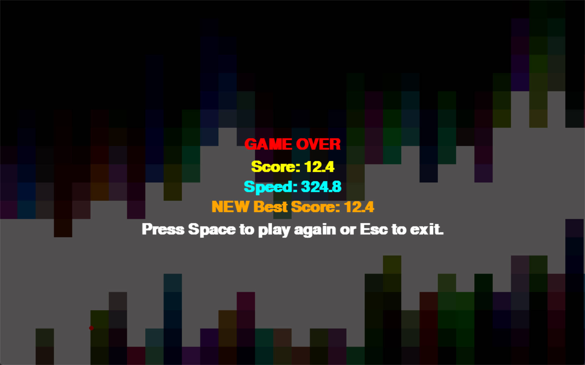

# 《Python程序设计基础》程序设计作品说明书

题目：Python游戏开发——Don't touch blocks

学院： 21计科04

姓名： 康佳程

学号： B20210404205

指导教师： 周景

起止日期：2023.11.10-2023.12.10

## 摘要

本次项目主要通过使用Python的Pygame框架进行一个游戏项目的开发，游戏名为Don't touch blocks（不要碰到方块）。我设计的这个游戏主要受到Flappy Bird的启发，游戏规则可以简要描述为控制一个小球在一个无限随机生成的方块地图中跳跃且小球不能碰到方块。在这个游戏的开发过程中，我合理地设计了游戏的整体架构，对游戏场景的管理、实体的管理进行了抽象，以面向对象编程范式为主完成了此项目。

关键词：Python应用开发 游戏开发 Pygame开发

## 第1章 需求分析

本次游戏项目有以下需求：
- 实现基本的游戏规则
- 游戏方块地图生成算法合理，游戏难度平衡
- 游戏应该对玩家的信息进行存档（如最高分等）
- 游戏应有友好的UI交互界面
- 游戏应有简约美的设计
- 游戏的运行性能应达到指定的游戏帧数

## 第2章 分析与设计

### 整体架构设计

首先，我设计了gamebase模块来作为游戏基础框架，几乎所有游戏代码要引用这个模块。gamebase主要包括了一些常用的常量（如游戏窗口尺寸、一帧的时间）。其次，我设计了一个抽象类Scene，Scene代表游戏的一个相关联的阶段，Scene下面包含着一些Entity类的实例，Entity也是一个抽象类，它提供了一些游戏实体的基础功能。继承Entity的抽象类还有SingletonEntity（代表单例实体）、DynamicEntity（场景会在每帧更新此实体）、PygameEventListenerEntity（场景会分发Pygame的事件给该实体）等等。gamebase提供了切换场景的函数，在场景中能够调用它们切换场景。

### 游戏场景设计

游戏主要分为MenuScene和GameScene，它们分别代表菜单场景和游戏场景（实际游戏过程）。还有一个BasicScene提供一些通用功能（如监听输入等）。

### 游戏地图生成算法设计

游戏的地图生成算法的思想可以概括为“先射箭再画靶”，先随机模拟出小球的运动轨迹，再根据这个小球的轨迹来随机生成方块地图，以确保地图是一定能通过的。为了保证精确性，不能使用浮点类型，而是使用Python中的定点数库decimal。地图生成在另外一个线程进行，以提高游戏性能。

### 游戏最高分的存储设计

游戏将最高分转换成json字符串存储在磁盘的文件上。为了防止玩家打开json文件修改最高分进行作弊，最高分将使用异或加密算法加密并使用Base64编码存储，并且同时存储了它的MD5值，用于有效性验证。

## 第3章 软件测试

### 游戏运行效果

主菜单界面：


游戏过程界面：


游戏失败界面：


### DecimalVector2类的单元测试：

```python
'''
Unit test for module utils.
'''

import unittest
from unittest import TestCase
from utils import DecimalVector2
from decimal import Decimal

class DecimalVector2TestCase(TestCase):
    def test_create(self):
        v1 = DecimalVector2(1, 2)
        self.assertEqual((v1.x, v1.y), (Decimal(1), Decimal(2)))
        v1 = DecimalVector2("1.12", "2.23")
        self.assertEqual((v1.x, v1.y), (Decimal("1.12"), Decimal("2.23")))

    def test_eq(self):
        self.assertEqual(DecimalVector2("1.123", "2.456"), DecimalVector2("1.123", "2.456"))

    def test_add_sub(self):
        self.assertEqual(DecimalVector2(1, 2) + DecimalVector2(2, 3), DecimalVector2(3, 5))
        self.assertEqual(DecimalVector2("3.2", "1.1") - DecimalVector2("1.1", "0.9"), DecimalVector2("2.1", "0.2"))

    def test_mul_div(self):
        self.assertEqual(DecimalVector2(2, 3) * DecimalVector2(4, 5), Decimal(2 * 4 + 3 * 5))
        self.assertEqual(DecimalVector2(2, 3) * DecimalVector2("4.2", "5.1"), 2 * Decimal("4.2") + 3 * Decimal("5.1"))
        self.assertEqual(DecimalVector2(2, 3) * Decimal("1.5"), DecimalVector2(3, "4.5"))
        self.assertEqual(DecimalVector2(1, 2) / 11, DecimalVector2(Decimal(1) / Decimal(11), Decimal(2) / Decimal(11)))

unittest.main()
```

## 结论

本次项目主要完成了一个基于Pygame库的Python游戏的开发。在开发过程中，我体会到了Python简约的设计思想，它将我的注意力主要集中在了程序逻辑的设计上，而一些不必要的细节可以忽略。对于这个游戏的开发，我对于自己的游戏需求设计了一个游戏场景管理和实体管理的架构，锻炼了抽象思维能力和架构设计能力。对于方块图随机生成算法的设计，让我感受到了很强的趣味性和技巧性，它和游戏的游玩体验和游戏难度的平衡有着十分密切的关系。

## 参考文献
无
